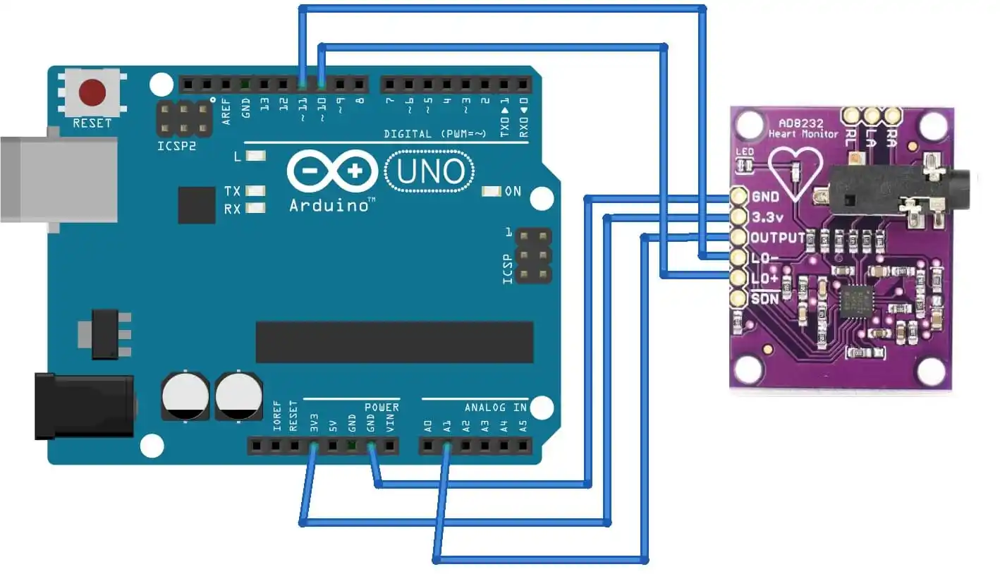
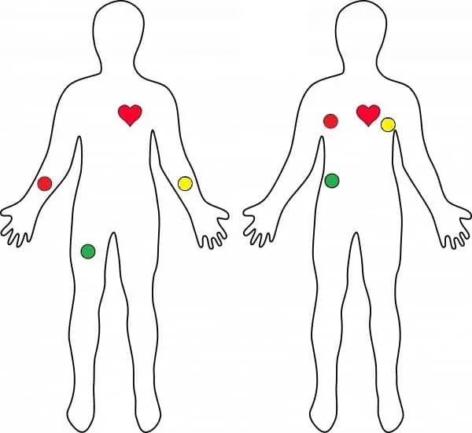
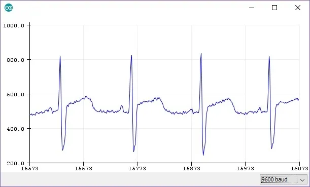

# Darklove Local AI Module

Darklove Local AI Module, Microsoft Yaz Okulu kapsamında geliştirilen, Türkçe
metinlerde duygusal işaretleri yerel olarak analiz eden gizlilik odaklı bir
.NET 10 Web API projesidir.

Uygulama, LM Studio veya Ollama üzerinden cihazda çalışan açık modelleri kullanır.
Geliştirme profili LM Studio'yu otomatik başlatabilir, bilgisayardaki modelleri
web ekranında listeler ve seçilen modeli analiz için yükler. Çalışma zamanı veya
model kullanılamıyorsa sistem açıklanabilir kural tabanlı analize geri döner.

> Proje tıbbi teşhis koymaz ve profesyonel psikolojik desteğin yerine geçmez.
> Kriz ifadeleri yapay zekâ modeline bırakılmaz; deterministik güvenlik
> kurallarıyla ele alınır.

## Özellikler

- LM Studio ve Ollama üzerinde Qwen, Granite, Mistral ve benzeri modellerle çalışabilir.
- Bilgisayardaki LLM'leri web ekranında listeler ve aktif modeli değiştirebilir.
- Model kataloğu kimliği veya Hugging Face bağlantısıyla indirme başlatabilir.
- LM Studio indirmelerinde boyut, hız ve yüzde ilerlemesini gösterir.
- Web arayüzünde Arduino Uno + AD8232 modülünden Web Serial API ile canlı EKG verisi okuyabilir.
- Yaklaşık BPM, ritim durumu ve sinyal kalitesini hesaplayıp yerel sohbet modeline bağlam olarak ekleyebilir.
- Model yanıtını JSON şemasıyla sınırlar ve uygulama tarafında doğrular.
- Model kapalıysa veya hata verirse kural tabanlı fallback kullanır.
- Kriz ifadelerinde modeli çağırmadan güvenli destek ve `112` yönlendirmesi yapar.
- `sadness`, `anxiety`, `hope`, `anger`, `neutral` ve `mixed` sonuçlarını destekler.
- Hangi analiz yönteminin ve modelin kullanıldığını API yanıtında gösterir.
- Kural skorlarını, eşleşen ifadeleri ve model skorlarını ayrı alanlarda döndürür.
- Yalnızca loopback üzerindeki model endpointlerine izin verir.
- Kullanıcı metnini saklamaz veya loglamaz.
- Kurulum gerektirmeyen Türkçe web demo ekranı içerir.
- ProblemDetails, health check, model status, OpenAPI ve Swagger UI içerir.
- Model, fallback, güvenlik, web arayüzü, EKG bağlamı ve HTTP davranışlarını kapsayan 46 test içerir.

## Teknolojiler

- .NET 10 ve ASP.NET Core Minimal API
- LM Studio ve Ollama yerel model çalışma zamanları
- JSON Schema structured output
- `IHttpClientFactory`
- HTML, CSS ve JavaScript ile aynı API içinde sunulan demo arayüzü
- OpenAPI ve Swagger UI
- Web Serial API ile tarayıcıdan yerel Arduino seri port erişimi
- xUnit ve `WebApplicationFactory`
- GitHub Actions

## Yerel Model Kullanımı

Bu bilgisayarda LM Studio zaten kurulu olduğu için ek model yöneticisi kurulumu
gerekmez. Uygulama geliştirme profilinde LM Studio arka plan servisini yerel
`lms` aracıyla başlatır. Ardından `http://localhost:5019` adresindeki **Yerel
model yöneticisi** bölümünden:

- Yüklü dil modellerini görebilir,
- **Yükle ve kullan** ile aktif modeli değiştirebilir,
- Katalog kimliği veya `huggingface.co` bağlantısıyla yeni model indirebilir,
- İndirme ilerlemesini izleyebilirsin.

> Başka bir bilgisayarda LM Studio veya Ollama çalışma zamanlarından en az biri
> kurulu olmalıdır. Web ekranı model indirmek için terminal komutu gerektirmez,
> ancak model dosyasını çalıştıracak yerel runtime'ın yerini tutmaz.

Geliştirme yapılandırması:

```json
{
  "LocalModel": {
    "Enabled": true,
    "Provider": "lmstudio",
    "Endpoint": "http://localhost:1234",
    "Model": "qwen/qwen3-vl-30b",
    "TimeoutSeconds": 300,
    "AutoStartRuntime": true
  }
}
```

Ollama kullanmak için:

```powershell
$env:LocalModel__Provider = "ollama"
$env:LocalModel__Endpoint = "http://localhost:11434"
$env:LocalModel__Model = "qwen3:4b"
```

Kullanılacak modelin lisansını proje gereksinimlerine göre ayrıca kontrol et.

## AD8232 / Arduino Kurulum Rehberi

Web arayüzünde **Kalp ritmine duyarlı yerel sohbet** bölümü vardır. Bu bölüm,
ek sunucu paketi kurmadan tarayıcının Web Serial API özelliğiyle Arduino seri
portuna bağlanır. Arduino, AD8232 sensöründen gelen ham analog değeri `9600`
baud üzerinden gönderir; Darklove bu veriden yaklaşık BPM, ritim etiketi ve
sinyal kalitesi çıkarıp yerel sohbet modeline yalnızca bağlam olarak ekler.

> Bu özellik tıbbi teşhis üretmez. AD8232 hobi/prototip modülüdür; ölçüm kalitesi
> elektrot temasına, kablolamaya ve örnekleme koduna bağlıdır. Göğüs ağrısı,
> bayılma, nefes darlığı veya hayati risk gibi durumlarda uygulama yerine 112
> ve profesyonel sağlık desteği kullanılmalıdır.

### Gerekli Parçalar

- Arduino Uno veya uyumlu kart
- AD8232 kalp atış hızı sensörü
- 3 elektrot pedi ve AD8232 elektrot kablosu
- Jumper kablolar
- USB kablosu
- Chrome veya Edge gibi Web Serial destekleyen tarayıcı

### Devre Bağlantısı



| AD8232 pini | Arduino Uno pini | Görev |
| --- | --- | --- |
| `GND` | `GND` | Ortak toprak |
| `3.3V` | `3.3V` | Sensör beslemesi |
| `OUTPUT` | `A0` | Ham analog EKG sinyali |
| `LO-` | `D11` | Elektrot kopukluk kontrolü |
| `LO+` | `D10` | Elektrot kopukluk kontrolü |

`SDN` pini bu örnekte kullanılmaz. Sensörü 3.3V ile beslemek önerilir.

### Elektrot Yerleşimi



AD8232 üzerinde yazan elektrot isimlerini takip et:

- `RA`: sağ kol / sağ göğüs tarafı
- `LA`: sol kol / sol göğüs tarafı
- `RL`: sağ bacak, karın veya alt gövde referans noktası

Elektrotlar insana bağlı değilse Arduino seri çıktısında `!` görünmesi normaldir.
Darklove web ekranı bunu “elektrot teması yok” olarak gösterir.

### Arduino Kodu

Kod Arduino IDE’ye yüklenir. Yükledikten sonra Arduino IDE içinde
**Araçlar > Seri Çizici** ekranından grafiği görebilirsin.

```ino
void setup() {
  Serial.begin(9600);
  pinMode(10, INPUT); // LO+
  pinMode(11, INPUT); // LO-
}

void loop() {
  if ((digitalRead(10) == 1) || (digitalRead(11) == 1)) {
    Serial.println('!');
  } else {
    Serial.println(analogRead(A0));
  }

  delay(1);
}
```

Seri Çizici üzerinde beklenen sinyal örneği:



### Darklove Web Arayüzünde Kullanım

1. Arduino kodunu karta yükle.
2. Arduino Uno ve AD8232 modülünü bilgisayara bağla.
3. `dotnet run --project backend/Darklove.LocalAI.Api --launch-profile http` ile uygulamayı çalıştır.
4. `http://localhost:5019` adresini Chrome veya Edge ile aç.
5. **Kalp ritmine duyarlı yerel sohbet** bölümünde baud değerini `9600` bırak.
6. **Arduino'ya bağlan** düğmesine bas ve tarayıcı izin penceresinde Arduino portunu seç. Bu bilgisayarda port `COM3` olarak görülmüştü.
7. Elektrotlar bağlıysa canlı sinyal, yaklaşık BPM, ritim durumu ve sinyal kalitesi görünür.
8. **Sohbet cevaplarında kalp ritmi bağlamını kullan** açıkken yerel model normal sohbet ederken ritim özetini dikkate alır.

Kaynak: [Robolink Akademi - AD8232 Kalp Atış Hızı Sensörü Kullanımı](https://akademi.robolinkmarket.com/ad8232-kalp-atis-hizi-sensoru-kullanimi-arduino/)

## API'yi Çalıştırma

Gereksinim: [.NET 10 SDK](https://dotnet.microsoft.com/download/dotnet/10.0)

```powershell
dotnet restore Darklove.LocalAI.slnx
dotnet run --project backend/Darklove.LocalAI.Api --launch-profile http
```

Uygulama başladıktan sonra:

- Web demo: `http://localhost:5019`
- Swagger UI: `http://localhost:5019/swagger`
- CMD sohbet endpointi: `http://localhost:5019/api/chat`
- Model durumu: `http://localhost:5019/api/model/status`
- Model kataloğu: `http://localhost:5019/api/models/`
- Health check: `http://localhost:5019/api/health`
- OpenAPI: `http://localhost:5019/openapi/v1.json`

## En Sade Kullanım: Windows CMD

Teknik komutlarla uğraşmadan terminal sürümünü açmak için proje klasöründeki
`darklove.cmd` dosyasına çift tıklayın veya CMD içinde çalıştırın:

```cmd
darklove.cmd
```

Mesajınızı doğrudan terminale yazabilirsiniz; Darklove normal bir sohbet
asistanı gibi yanıt verir. Duygu analizi raporu istiyorsanız `analiz`
yazın; bu komut o ana kadarki sohbet geçmişini analiz eder. `analiz <metin>`
yazarsanız sohbet geçmişiyle birlikte ek metin de analize katılır. `şartlar`
kullanım şartlarını, `modeller`
bilgisayardaki yerel modelleri, `durum` aktif sağlayıcıyı gösterir; `çıkış`
programı kapatır. API çalışmıyorsa istemci onu otomatik olarak hazırlar ve
başlatır. İstemci yalnızca kendi başlattığı API sürecini çıkışta kapatır.

Tek bir sohbet mesajı gönderip kapanmak için:

```cmd
darklove.cmd -Once "Naber, nasıl gidiyor?"
```

Web demo ekranında bir örnek metin seçebilir veya en fazla 2.000 karakterlik
kendi metnini yazıp **Metni analiz et** düğmesine basabilirsin. Ekran; bulunan
duyguyu, güven değerini, analiz yöntemini, kural/model skorlarını, eşleşen
ifadeleri ve güvenli kullanıcı mesajını gösterir.

`/api/model/status` yanıtındaki durumlar:

- `ready`: Seçilen model yüklü ve kullanıma hazır.
- `model-not-loaded`: Model diskte var fakat henüz belleğe yüklenmedi.
- `model-not-found`: Seçilen model yerel katalogda bulunamadı.
- `runtime-unavailable`: LM Studio veya Ollama çalışmıyor ya da ulaşılamıyor.
- `disabled`: Model kullanımı yapılandırmada kapalı.

## Test

```powershell
dotnet build Darklove.LocalAI.slnx
dotnet test Darklove.LocalAI.slnx
```

Testler gerçek model indirmeden sahte LM Studio ve Ollama HTTP yanıtlarıyla
listeleme, seçme, structured output ve indirme sözleşmelerini doğrular.

## API Örneği

`POST /api/emotion/analyze`

```json
{
  "userText": "İçimde ağır bir hüzün var."
}
```

Model kullanıldığında örnek yanıt:

```json
{
  "detectedEmotion": "sadness",
  "confidence": 0.86,
  "scores": {
    "sadness": 0,
    "anxiety": 0,
    "hope": 0,
    "anger": 0
  },
  "matchedKeywords": {},
  "riskLevel": "none",
  "needsSupportWarning": false,
  "motivationMessage": "Bugün zor geçiyor olabilir...",
  "analysisMethod": "open-source-model",
  "model": "qwen/qwen3-vl-30b",
  "modelScores": {
    "sadness": 0.86,
    "anxiety": 0.08,
    "hope": 0.02,
    "anger": 0.01,
    "neutral": 0.03
  }
}
```

Fallback kullanılırsa:

```json
{
  "analysisMethod": "rule-based-fallback",
  "model": "qwen/qwen3-vl-30b",
  "fallbackReason": "model-unavailable"
}
```

`scores` mevcut kural eşleşme sayılarını, `modelScores` ise modelin 0-1
aralığındaki duygu skorlarını gösterir.

## Güvenlik Yaklaşımı

- Model endpointi yalnızca `localhost`, `127.0.0.1` veya `::1` olabilir.
- Kullanıcı metni buluta gönderilmez.
- Kullanıcı metni uygulama loglarına yazılmaz.
- Modelden motivasyon veya kriz tavsiyesi alınmaz.
- Model yalnızca yapılandırılmış duygu sınıflandırması üretir.
- Kriz tespiti ve kullanıcı mesajları uygulama kodunda kalır.

## Proje Yapısı

```text
backend/   API, web demo, model yöneticisi, LM Studio/Ollama istemcileri ve güvenlik kuralları
tests/     Kural, model istemcisi, fallback ve HTTP entegrasyon testleri
docs/      Mimari, yol haritası, günlük ve teknik rapor
.github/   GitHub Actions CI iş akışı
```

Projenin neden ve nasıl geliştirildiğini anlatan ayrıntılı belge:
[Türkçe Teknik Rapor](docs/technical-report-tr.md)

## Sonraki Aşamalar

- Etiketli Türkçe değerlendirme veri kümesi hazırlamak
- Qwen model boyutlarını doğruluk ve hız açısından karşılaştırmak
- Microsoft Foundry Local için ikinci bir model adaptörü eklemek
- Kural ve model sonuçlarını precision, recall ve F1 ile ölçmek
