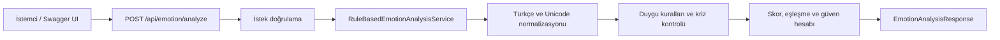

# Mimari

## Genel Bakış

Darklove Local AI Module, .NET 10 üzerinde çalışan küçük ve odaklı bir Minimal
API'dir. İlk sürümde veritabanı, bulut servisi veya harici yapay zekâ API'si
kullanılmaz. Kullanıcı metni yalnızca istek süresince bellekte işlenir.

## Katmanlar

### Sunum Katmanı

`EmotionAnalysisEndpoints`, HTTP sözleşmesini yönetir. İstek doğrulaması burada
yapılır, ancak analiz kuralları endpoint içinde bulunmaz.

### İş Mantığı Katmanı

`RuleBasedEmotionAnalysisService`, metin normalizasyonu, anahtar ifade eşleşmesi,
duygu seçimi, güven hesabı ve kriz yanıtından sorumludur.

### Sözleşmeler

`EmotionAnalysisRequest` ve `EmotionAnalysisResponse`, API'nin istemciye açık
JSON yapısını tanımlar. Bu modeller herhangi bir veri tabanı modeline bağlı
değildir.

### Altyapı

Health endpointi ASP.NET Core `HealthCheckService` altyapısını kullanır.
`Program.cs`; dependency injection, ProblemDetails, OpenAPI, Swagger UI, HTTPS
ve endpoint eşlemelerini bir araya getirir.

## Tasarım Kararları

- Küçük API yüzeyi nedeniyle Minimal API seçildi.
- İş kuralları test edilebilsin diye route handler'dan ayrıldı.
- Servis durumsuz olduğu için singleton olarak kaydedildi.
- Tam kelime/ifade eşleşmesiyle `sinir` ve `sinir sistemi` gibi yanlış pozitifler
  önlendi.
- Kriz kontrolü duygu skorundan bağımsız tutuldu.
- Swagger UI yalnızca Development ortamında açıldı.
- Kullanıcı metni gizlilik nedeniyle loglanmaz ve saklanmaz.

Ayrıntılı açıklama için [Türkçe Teknik Rapor](technical-report-tr.md) belgesine
bakın.
