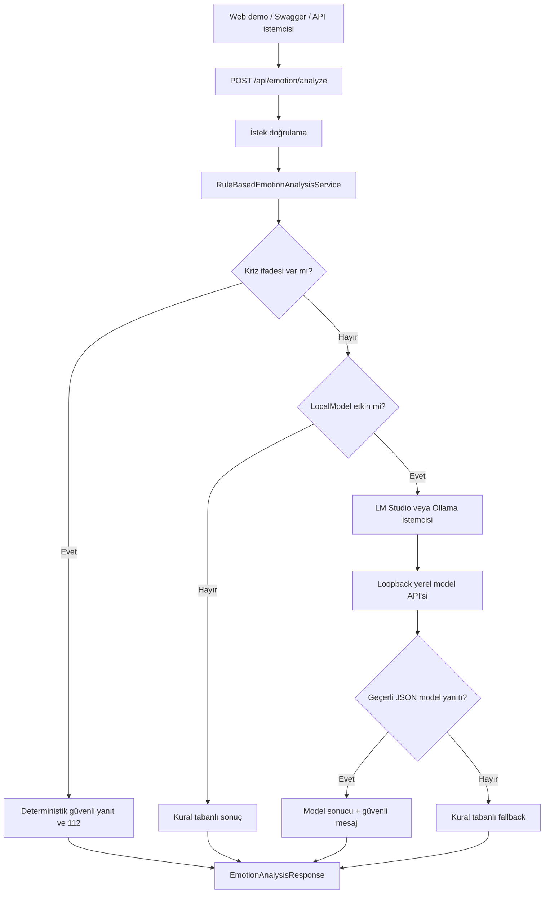

# Mimari

## Genel Bakış

Darklove Local AI Module, .NET 10 üzerinde çalışan hibrit bir Minimal API'dir.
Birincil analiz LM Studio veya Ollama üzerinde çalışan açık yerel modelle yapılır.
Model hazır değilse mevcut kural tabanlı servis otomatik fallback sağlar.

## Katmanlar

### Sunum Katmanı

`wwwroot` içindeki Türkçe demo ekranı, model durumunu ve analiz sonuçlarını
tarayıcıda gösterir. Ayrı bir frontend sunucusu veya derleme zinciri gerektirmez.
Demo ekranı ayrıca Web Serial API ile Arduino Uno + AD8232 modülünden canlı EKG
verisi okuyabilir. Bu okuma tarayıcı izniyle yapılır; backend seri port sürücüsü
veya ek masaüstü kurulumu gerektirmez.
`EmotionAnalysisEndpoints`, HTTP sözleşmesini ve doğrulamayı yönetir.
`ChatEndpoints`, normal sohbet metnini ve isteğe bağlı kalp ritmi bağlamını
yerel modele iletir. Bu endpoint duygu analizi raporu üretmez.
`OpenSourceModelEndpoints`, çalışma zamanı durumunu, yerel model kataloğunu,
aktif model seçimini ve indirme işlerini yönetir.

### Hibrit İş Mantığı

`HybridEmotionAnalysisService` önce deterministik güvenlik kontrolünü çalıştırır.
Risk yoksa ve model etkinse `IOpenSourceModelClient` üzerinden yerel modele
gider. Model hatalarında kural tabanlı sonucu döndürür.

### Kural ve Güvenlik Katmanı

`RuleBasedEmotionAnalysisService`, tam kelime eşleşmesi, kriz kontrolü ve
açıklanabilir kural skorlarını üretir. `EmotionResponsePolicy`, kullanıcıya
verilen mesajları kod içinde tutar; modelin tavsiye üretmesine izin verilmez.

### Yerel Model Katmanı

`LmStudioOpenSourceModelClient`, LM Studio REST API ile model listeler, yükler,
indirir ve OpenAI uyumlu structured output endpointinden sınıflandırma alır.
`OllamaOpenSourceModelClient` aynı analiz sözleşmesini Ollama `/api/chat` ile
uygular. Yanıtlar izin verilen duygu ve skor aralıklarına göre doğrulanır.

### Yapılandırma

`LocalModelOptions`; sağlayıcı, loopback endpointi, model adı ve zaman aşımını
tanımlar. Uzak endpointler doğrulama aşamasında reddedilir.

## Tasarım Kararları

- Geliştirme profili mevcut LM Studio kurulumunu kullanır; Ollama alternatif
  sağlayıcı olarak korunur.
- `ILocalModelSelection` aktif model adını thread-safe biçimde tutar.
- Model indirme girdileri katalog kimliği veya `huggingface.co` bağlantısıyla sınırlıdır.
- Model entegrasyonu `IOpenSourceModelClient` arayüzünün arkasındadır.
- Kriz güvenliği hiçbir koşulda modele devredilmez.
- Model yalnızca sınıflandırma yapar; kullanıcı mesajları deterministiktir.
- Model hatası API'yi durdurmaz, `rule-based-fallback` sonucu üretir.
- `scores` ve `modelScores` farklı anlamları korumak için ayrı alanlardır.
- AD8232 verisi yalnızca yaklaşık sohbet bağlamıdır; tıbbi teşhis veya klinik
  karar üretimi modele devredilmez.
- Web Serial seçimi kullanıcı onayıyla tarayıcıda yapılır; seri port adı sunucu
  tarafında kalıcı olarak saklanmaz.
- Model endpointi yalnızca loopback olabilir.
- Hassas kullanıcı metni saklanmaz ve loglanmaz.
- Demo arayüzü aynı origin üzerinden API'ye gider; ek CORS yapılandırması gerekmez.

Ayrıntılı açıklama için [Türkçe Teknik Rapor](technical-report-tr.md) belgesine
bakın.
