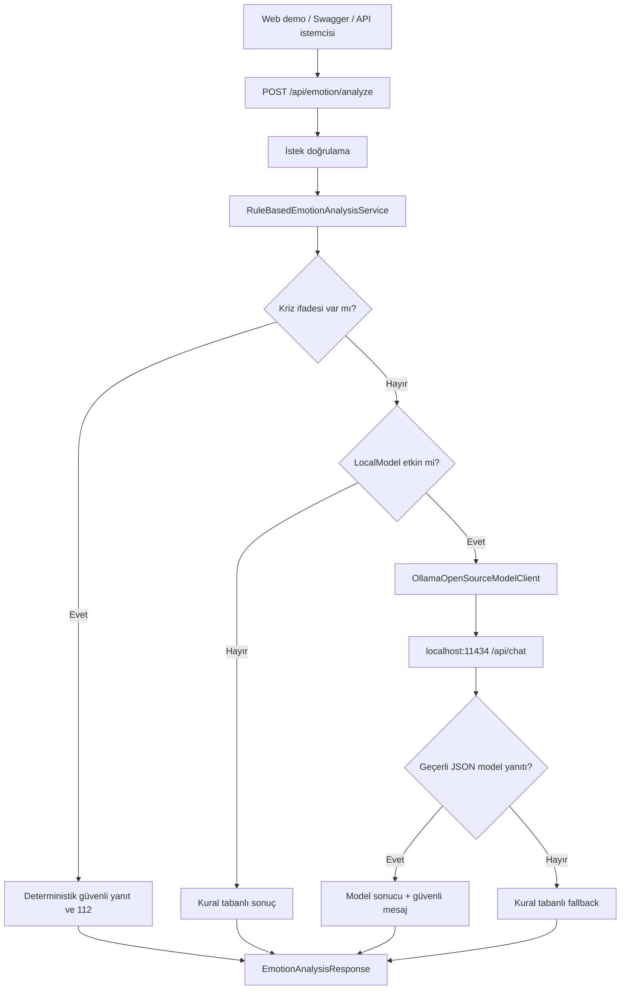

# Mimari

## Genel Bakış

Darklove Local AI Module, .NET 10 üzerinde çalışan hibrit bir Minimal API'dir.
Birincil analiz Ollama üzerinde çalışan açık ağırlıklı yerel modelle yapılır.
Model hazır değilse mevcut kural tabanlı servis otomatik fallback sağlar.

## Katmanlar

### Sunum Katmanı

`wwwroot` içindeki Türkçe demo ekranı, model durumunu ve analiz sonuçlarını
tarayıcıda gösterir. Ayrı bir frontend sunucusu veya derleme zinciri gerektirmez.
`EmotionAnalysisEndpoints`, HTTP sözleşmesini ve doğrulamayı yönetir.
`OpenSourceModelEndpoints`, Ollama ve seçilen modelin hazır olup olmadığını
`GET /api/model/status` üzerinden gösterir.

### Hibrit İş Mantığı

`HybridEmotionAnalysisService` önce deterministik güvenlik kontrolünü çalıştırır.
Risk yoksa ve model etkinse `IOpenSourceModelClient` üzerinden yerel modele
gider. Model hatalarında kural tabanlı sonucu döndürür.

### Kural ve Güvenlik Katmanı

`RuleBasedEmotionAnalysisService`, tam kelime eşleşmesi, kriz kontrolü ve
açıklanabilir kural skorlarını üretir. `EmotionResponsePolicy`, kullanıcıya
verilen mesajları kod içinde tutar; modelin tavsiye üretmesine izin verilmez.

### Yerel Model Katmanı

`OllamaOpenSourceModelClient`, `IHttpClientFactory` ile Ollama'nın `/api/chat`
endpointine gider. İstek structured output JSON şeması içerir. Yanıt hem JSON
olarak ayrıştırılır hem de izin verilen duygu ve skor aralıklarına göre
doğrulanır.

### Yapılandırma

`LocalModelOptions`; sağlayıcı, loopback endpointi, model adı ve zaman aşımını
tanımlar. Uzak endpointler doğrulama aşamasında reddedilir.

## Tasarım Kararları

- Yerel model çalışma zamanı olarak Ollama seçildi; farklı modeller tek API ile
  değiştirilebilir.
- Model entegrasyonu `IOpenSourceModelClient` arayüzünün arkasındadır.
- Kriz güvenliği hiçbir koşulda modele devredilmez.
- Model yalnızca sınıflandırma yapar; kullanıcı mesajları deterministiktir.
- Model hatası API'yi durdurmaz, `rule-based-fallback` sonucu üretir.
- `scores` ve `modelScores` farklı anlamları korumak için ayrı alanlardır.
- Model endpointi yalnızca loopback olabilir.
- Hassas kullanıcı metni saklanmaz ve loglanmaz.
- Demo arayüzü aynı origin üzerinden API'ye gider; ek CORS yapılandırması gerekmez.

Ayrıntılı açıklama için [Türkçe Teknik Rapor](technical-report-tr.md) belgesine
bakın.
