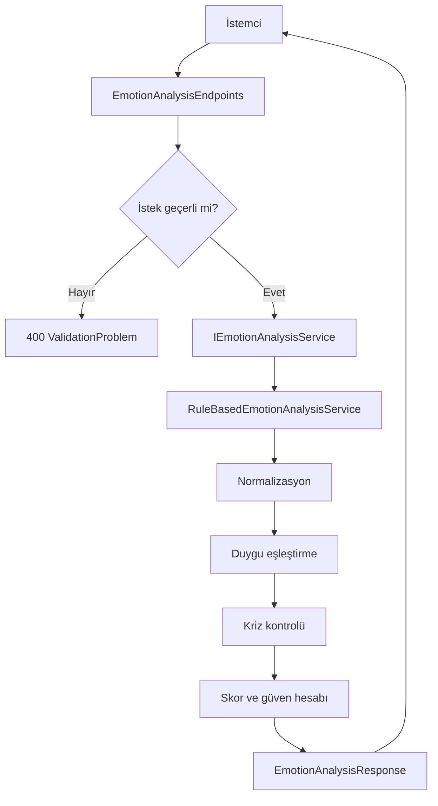

# Darklove Local AI Module Teknik Raporu

## 1. Belgenin Amacı

Bu belge, Darklove Local AI Module projesinin neden geliştirildiğini, mevcut
sürümde hangi kararların alındığını ve kodun nasıl çalıştığını ayrıntılı biçimde
açıklar. Belge; projeyi geliştiren kişinin kodu savunabilmesi, başka bir
geliştiricinin projeyi sürdürebilmesi ve Microsoft Yaz Okulu jürisinin teknik
yaklaşımı izleyebilmesi için hazırlanmıştır.

## 2. Projenin Problemi

Duygusal destek veya motivasyon uygulamaları, kullanıcıların hassas metinler
paylaşabildiği sistemlerdir. Bu metinlerin zorunlu olarak bulut tabanlı bir
yapay zekâ servisine gönderilmesi şu sorunları doğurabilir:

- Kullanıcı mahremiyeti konusunda endişe oluşabilir.
- İnternet bağlantısı olmadan sistem çalışmayabilir.
- Harici servis maliyeti veya kota sınırı oluşabilir.
- Sonucun neden üretildiğini açıklamak zorlaşabilir.
- Eğitim projesinde hata analizi dış servise bağımlı hale gelebilir.

Bu nedenle projenin uzun vadeli hedefi, duygu analizini ve destek mesajı
üretimini yerel cihazda gerçekleştirmektir.

## 3. Mevcut Sürümün Hedefi

Mevcut sürüm, gerçek bir makine öğrenmesi modeli değildir. Kural tabanlı ve
açıklanabilir bir sağlam MVP'dir. Bu tercih bilinçlidir:

- API sözleşmesi model entegrasyonundan önce sabitlenir.
- Gizlilik ve kriz güvenliği erken aşamada ele alınır.
- Sonuçlar deterministik olduğu için kolayca test edilir.
- Gelecekteki modelin sonuçları karşılaştırılabilir.
- Foundry Local entegrasyonu aynı servis arayüzünün yeni uygulaması olarak
  eklenebilir.

MVP'nin başarı ölçütü, her cümleyi kusursuz anlamak değil; tanımlı kuralları
öngörülebilir, açıklanabilir ve güvenli biçimde uygulamaktır.

## 4. Kapsam ve Kapsam Dışı Konular

### Bu sürümde bulunanlar

- .NET 10 Web API
- Türkçe metin normalizasyonu
- Dört temel duygu kategorisi
- `neutral` ve `mixed` sonuçları
- Açıklanabilir skor ve eşleşen ifade listesi
- Kriz ifadesi kontrolü
- ProblemDetails doğrulaması
- Health check
- OpenAPI ve Swagger UI
- Birim ve entegrasyon testleri
- GitHub Actions CI

### Bu sürümde bulunmayanlar

- Makine öğrenmesi veya büyük dil modeli
- Microsoft Foundry Local entegrasyonu
- Python deneyleri
- Veritabanı
- Kullanıcı hesabı ve kimlik doğrulama
- Kullanıcı metni geçmişi
- Ayrı frontend uygulaması
- Tıbbi tanı veya tedavi önerisi

Bu sınırlar projenin eksik olduğu anlamına gelmez. Sağlam MVP'nin hangi problemi
çözdüğünü ve sonraki fazın nerede başladığını açık hale getirir.

## 5. Teknoloji Seçimleri ve Nedenleri

### .NET 10

.NET 10 güncel uzun destekli .NET sürümüdür. Güçlü tip sistemi, yerleşik
dependency injection, health check, ProblemDetails ve OpenAPI desteği bu proje
için gereken altyapıyı az ek bağımlılıkla sağlar.

### ASP.NET Core Minimal API

Projede iki ana endpoint vardır. Bu nedenle controller tabanlı daha ağır bir
yapı yerine Minimal API kullanılmıştır. Minimal API seçimi iş mantığının
`Program.cs` içine yazılması anlamına gelmez. Endpoint yalnızca HTTP
sorumluluklarını taşır, analiz ayrı servistedir.

### Dependency Injection

`IEmotionAnalysisService`, endpoint ile analiz uygulaması arasındaki
sözleşmedir. `RuleBasedEmotionAnalysisService` bu sözleşmenin mevcut
uygulamasıdır. Gelecekte `FoundryLocalEmotionAnalysisService` yazılarak endpoint
değiştirilmeden model tabanlı analiz eklenebilir.

### OpenAPI ve Swagger UI

OpenAPI, API'nin makine tarafından okunabilir sözleşmesini üretir. Swagger UI
ise jüri demosunda ve geliştirme sırasında endpointlerin tarayıcıdan
çalıştırılmasını sağlar. Bilgi ifşasını azaltmak için Swagger UI yalnızca
Development ortamında etkinleştirilmiştir.

### xUnit ve WebApplicationFactory

xUnit saf iş mantığını test eder. `WebApplicationFactory<Program>` uygulamayı
gerçek Kestrel portu açmadan test sunucusunda çalıştırarak route, JSON,
dependency injection, doğrulama ve middleware davranışını birlikte doğrular.

## 6. Proje Mimarisi



Temel tasarım ilkesi sorumluluk ayrımıdır:

- `Program.cs` uygulamayı kurar.
- Endpoint HTTP isteğini yönetir.
- Servis analiz kararlarını üretir.
- DTO'lar dış API sözleşmesini tanımlar.
- Testler davranışı korur.

## 7. Klasör ve Dosyaların Görevleri

### `Darklove.LocalAI.slnx`

API ve test projelerini tek çözüm altında toplar. `dotnet build` ve `dotnet test`
komutlarının tüm projelerde birlikte çalışmasını sağlar.

### `backend/Darklove.LocalAI.Api/Program.cs`

Uygulamanın başlangıç noktasıdır:

1. OpenAPI servisini ekler.
2. Exception handler ve ProblemDetails yapılandırmasını ekler.
3. Health check altyapısını kaydeder.
4. Analiz servisini dependency injection'a singleton olarak kaydeder.
5. Development ortamında OpenAPI ve Swagger UI'ı açar.
6. Ortama göre HSTS ve HTTPS yönlendirmesini ayarlar.
7. Health ve emotion endpointlerini eşler.

Dosyanın sonunda bulunan `public partial class Program`, entegrasyon testlerinin
uygulama giriş noktasını bulabilmesi için gereklidir.

### `Features/EmotionAnalysis/Contracts/EmotionAnalysisRequest.cs`

İstemciden alınan JSON gövdesini temsil eder. `UserText` nullable tanımlanmıştır;
çünkü eksik veya `null` gelen değer endpoint doğrulaması tarafından anlamlı bir
400 yanıtına dönüştürülmelidir.

### `Features/EmotionAnalysis/Contracts/EmotionAnalysisResponse.cs`

Analizin dışarıya açık sonucudur:

- `DetectedEmotion`: Seçilen duygu kodu
- `Confidence`: Sezgisel güven değeri
- `Scores`: Her duygu için eşleşme sayısı
- `MatchedKeywords`: Eşleşen kurallar
- `RiskLevel`: `none` veya `high`
- `NeedsSupportWarning`: Eski istemciler için boolean uyarı
- `MotivationMessage`: Türkçe kullanıcı mesajı

### `Features/EmotionAnalysis/Services/IEmotionAnalysisService.cs`

Analiz yeteneğinin soyut sözleşmesidir. Endpoint somut sınıfa değil bu arayüze
bağımlıdır. Bu, test edilebilirliği ve gelecekte model değiştirmeyi kolaylaştırır.

### `Features/EmotionAnalysis/Services/RuleBasedEmotionAnalysisService.cs`

Projenin ana iş mantığıdır. Şunları gerçekleştirir:

- Türkçe ve Unicode normalizasyonu
- Duygu kurallarının değerlendirilmesi
- Kriz ifadelerinin bağımsız kontrolü
- Skorların hazırlanması
- `neutral`, `mixed` veya tek duygu seçimi
- Güven değerinin hesaplanması
- Uygun kullanıcı mesajının seçilmesi

Servis herhangi bir değişken kullanıcı durumu saklamadığı için singleton olarak
güvenle kullanılabilir. Statik kurallar yalnızca okunur.

### `Features/EmotionAnalysis/Endpoints/EmotionAnalysisEndpoints.cs`

`POST /api/emotion/analyze` endpointini tanımlar. En fazla 2.000 karakter
kuralını uygular, boş metni reddeder ve hataları `ValidationProblem` olarak
döndürür. Analizi kendisi yapmaz; servise iletir.

Endpoint metadata'sı Swagger'da özet, açıklama, kabul edilen gövde ve olası HTTP
yanıtlarını gösterir.

### `Infrastructure/Health/HealthEndpointExtensions.cs`

`GET /api/health` endpointini tanımlar. Yerleşik `HealthCheckService` üzerinden
kontrolleri çalıştırır ve servisin durumunu JSON olarak döndürür. Gelecekte bir
model servisi veya veritabanı eklenirse aynı health altyapısına yeni kontroller
eklenebilir.

### `appsettings.json`

Genel log seviyelerini, host politikasını ve varsayılan HTTPS yönlendirme
ayarını taşır. Kullanıcı metni için özel bir loglama yapılmaz.

### `appsettings.Development.json`

Yerel HTTP geliştirme profilinde HTTPS portu bulunamadı uyarısı oluşmaması için
HTTPS yönlendirmesini varsayılan olarak kapatır.

### `Properties/launchSettings.json`

İki geliştirme profili sağlar:

- `http`: `http://localhost:5019`
- `https`: `https://localhost:7239`

Her iki profil Swagger sayfasını açar. HTTPS profili yönlendirmeyi ortam
değişkeniyle tekrar etkinleştirir.

### `Darklove.LocalAI.Api.http`

IDE içinden health, normal analiz, mixed sonuç, kriz yanıtı ve doğrulama hatası
isteklerini çalıştırmak için hazır örnekler içerir.

### `tests/Darklove.LocalAI.Api.Tests`

Saf servis testlerini ve HTTP entegrasyon testlerini içerir. Test projesi üretim
projesine `ProjectReference` ile bağlıdır.

### `.github/workflows/ci.yml`

Main branch pushlarında ve pull requestlerde şu sırayı otomatik çalıştırır:

1. Depoyu indirir.
2. .NET 10 SDK kurar.
3. NuGet paketlerini restore eder.
4. Release build alır.
5. Tüm testleri çalıştırır.

## 8. Metin Analizi Algoritması

### 8.1 Normalizasyon

Kullanıcı metni doğrudan karşılaştırılmaz. Önce:

1. Unicode `FormC` biçimine dönüştürülür.
2. `tr-TR` kültürüyle küçük harfe çevrilir.
3. Birden fazla boşluk tek boşluğa indirilir.
4. Baş ve sondaki boşluklar temizlenir.

Türkçe kültürü özellikle `I`, `İ`, `ı` ve `i` dönüşümleri için önemlidir.
Standart kültürden bağımsız dönüşüm Türkçe metinlerde yanlış eşleşmeye yol
açabilir.

### 8.2 Tam Kelime ve İfade Eşleşmesi

Her anahtar ifade Unicode harf ve sayı sınırlarını kontrol eden bir düzenli
ifadeye dönüştürülür:

```text
(?<![harf veya sayı])ANAHTAR_IFADE(?![harf veya sayı])
```

Bu yaklaşım sayesinde `sinir` kelimesini arayıp `sinir sistemi` ifadesini öfke
olarak işaretlemek yerine yalnızca `sinirliyim` gibi açık kurallar kullanılır.

### 8.3 Kural Listeleri

Dört duygu kategorisi vardır:

- `sadness`: üzgünlük, yalnızlık, yorgunluk ve mutsuzluk ifadeleri
- `anxiety`: kaygı, stres, panik, korku ve gerginlik ifadeleri
- `hope`: umut, iyi hissetme, başarma ve toparlanma ifadeleri
- `anger`: sinirlilik, öfke, bıkma ve kızgınlık ifadeleri

Bağlamı zayıf olan tek başına `iyi` veya `sinir` gibi kurallar kullanılmaz.

### 8.4 Tekrarların Puanlanması

Bir kural metinde kaç kez tekrarlanırsa tekrarlansın yalnızca bir puan verir.

Örnek:

```text
Yorgunum, gerçekten yorgunum ve yine yorgunum.
```

`yorgunum` kuralının sadness skoruna katkısı `1` olur. Böylece kullanıcının aynı
kelimeyi tekrarlaması güven değerini yapay biçimde yükseltmez.

### 8.5 Duygu Seçimi

```text
topScore = en yüksek duygu skoru

eğer topScore == 0:
    detectedEmotion = neutral
aksi halde en yüksek skora sahip birden fazla duygu varsa:
    detectedEmotion = mixed
aksi halde:
    detectedEmotion = en yüksek skorlu duygu
```

Eşitlikte ilk dictionary elemanını seçmek yerine `mixed` dönülmesi sonucu daha
dürüst ve açıklanabilir yapar.

## 9. Güven Değeri

`confidence` bir makine öğrenmesi olasılığı değildir. Kural eşleşmelerinden
üretilen sezgisel bir göstergedir.

### Neutral

```text
confidence = 0.0
```

Eşleşme olmadığı için güven sıfırdır.

### Mixed

```text
confidence = min(0.70, 0.40 + topScore × 0.10)
```

Birden fazla duygu eşit olduğundan değer `0.70` ile sınırlandırılır.

### Tek Duygu

```text
scoreMargin = topScore - secondScore
confidence = min(
    0.95,
    0.50 + topScore × 0.10 + scoreMargin × 0.10
)
```

En yüksek skor arttıkça ve ikinci duyguya fark açıldıkça güven yükselir.

Örnek:

```text
sadness = 2
ikinci skor = 0
scoreMargin = 2
confidence = 0.50 + 0.20 + 0.20 = 0.90
```

Sonuç iki ondalık basamağa yuvarlanır.

## 10. Kriz Güvenliği

Kriz ifadeleri duygu skorundan bağımsız değerlendirilir. Bunun nedeni,
`yaşamak istemiyorum` gibi bir metnin ana duygu kurallarından hiçbiriyle
eşleşmemesi durumunda bile güvenlik açısından önemli olmasıdır.

Risk eşleşirse:

- `riskLevel` değeri `high` olur.
- `needsSupportWarning` değeri `true` olur.
- Normal motivasyon mesajı kullanılmaz.
- Kullanıcıya yalnız kalmaması ve güvendiği bir kişiye ulaşması söylenir.
- Profesyonel destek istemesi önerilir.
- Hayati tehlikede Türkiye'de 112'yi araması belirtilir.

Bu mekanizma bir risk değerlendirme veya teşhis sistemi değildir. Yalnızca
sınırlı ve açık ifadeler için koruyucu yönlendirme sağlar.

## 11. İstek Doğrulama ve Hata Yönetimi

### Boş metin

`null`, boş veya yalnızca boşluk içeren metin `400 Bad Request` döndürür.

### Uzun metin

2.000 karakter üzerindeki metin `400 Bad Request` döndürür. Bu sınır, MVP'nin
kısa kullanıcı mesajı amacına uygundur ve gereksiz kaynak tüketimini sınırlar.

### Bozuk JSON

JSON ayrıştırma hataları `BadHttpRequestException` olarak yakalanır ve genel
500 hatasına dönüşmeden `400 ProblemDetails` olarak döndürülür.

### ProblemDetails

Hata yanıtları ortak bir yapı kullanır:

```json
{
  "title": "İstek doğrulanamadı.",
  "status": 400,
  "detail": "Lütfen kullanıcı metnini kontrol edip tekrar deneyin.",
  "errors": {
    "userText": [
      "Kullanıcı metni boş bırakılamaz."
    ]
  },
  "traceId": "..."
}
```

`traceId`, kullanıcı metnini göstermeden teknik hata takibini kolaylaştırır.

## 12. API Sözleşmesi

### Health

```http
GET /api/health
```

```json
{
  "status": "running",
  "project": "Darklove Local AI Module",
  "version": "1.0.0",
  "module": "backend-api"
}
```

### Emotion Analyze

```http
POST /api/emotion/analyze
Content-Type: application/json
```

```json
{
  "userText": "Bugün kendimi yalnız ve yorgun hissediyorum."
}
```

Başarılı yanıt:

```json
{
  "detectedEmotion": "sadness",
  "confidence": 0.9,
  "scores": {
    "sadness": 2,
    "anxiety": 0,
    "hope": 0,
    "anger": 0
  },
  "matchedKeywords": {
    "sadness": [
      "yalnız",
      "yorgun"
    ]
  },
  "riskLevel": "none",
  "needsSupportWarning": false,
  "motivationMessage": "Bugün zor geçiyor olabilir..."
}
```

## 13. Gizlilik ve Etik Kararlar

- Kullanıcı metni veritabanına yazılmaz.
- Kullanıcı metni loglanmaz.
- Harici bulut AI servisine istek gönderilmez.
- API sonucu tıbbi teşhis olarak sunulmaz.
- Confidence değeri gerçek model olasılığı gibi tanıtılmaz.
- Kriz mesajı, kullanıcıyı uygulamaya bağımlı kılmak yerine gerçek insan ve acil
  yardım kaynaklarına yönlendirir.
- Swagger UI üretim ortamında kapalıdır.
- Projede secret veya API anahtarı bulunmaz.

## 14. Test Stratejisi

### Birim testleri neden var?

Analiz servisi HTTP'den bağımsızdır. Birim testleri kuralları hızlı ve
deterministik biçimde doğrular:

- Dört duygu kategorisinin algılanması
- Eşleşme olmadığında neutral sonucu
- Eşit skorda mixed sonucu
- Türkçe büyük harf dönüşümü
- Tekrarlanan kuralın bir kez sayılması
- Tam kelime eşleşmesi
- Güven formülü
- Kriz mesajı ve 112 yönlendirmesi

### Entegrasyon testleri neden var?

Servisin tek başına doğru olması API'nin doğru olduğu anlamına gelmez.
Entegrasyon testleri şunları doğrular:

- Health endpointinin gerçek JSON cevabı
- Dependency injection ile analiz servisinin çağrılması
- JSON serileştirme
- Boş ve uzun metin için ProblemDetails
- Bozuk JSON için 400 yanıtı
- OpenAPI belgesinin erişilebilirliği
- Swagger UI'ın Development ortamında erişilebilirliği

Toplam 20 test bulunmaktadır.

## 15. Kurulum ve Çalıştırma

### Gereksinim

.NET 10 SDK kurulu olmalıdır.

### Restore

```powershell
dotnet restore Darklove.LocalAI.slnx
```

### Derleme

```powershell
dotnet build Darklove.LocalAI.slnx
```

### HTTP profili

```powershell
dotnet run --project backend/Darklove.LocalAI.Api --launch-profile http
```

Swagger:

```text
http://localhost:5019/swagger
```

### HTTPS profili

```powershell
dotnet run --project backend/Darklove.LocalAI.Api --launch-profile https
```

Swagger:

```text
https://localhost:7239/swagger
```

### Test

```powershell
dotnet test Darklove.LocalAI.slnx
```

## 16. Jüri Demo Akışı

1. Swagger UI'ı aç.
2. `GET /api/health` ile API'nin çalıştığını göster.
3. Sadness örneğini gönder ve iki eşleşmeyi göster.
4. Response içindeki tüm duygu skorlarını açıkla.
5. `Sinir sistemi hakkında okuyorum` örneğiyle yanlış pozitif düzeltmesini
   göster.
6. Sadness ve anger eşitliğinde `mixed` sonucunu göster.
7. Boş metin göndererek ProblemDetails yanıtını göster.
8. Kriz örneğini göndererek normal mesajın güvenli destek mesajıyla
   değiştiğini göster.
9. Terminalde `dotnet test Darklove.LocalAI.slnx` çalıştır ve test sonucunu
   göster.
10. Sonraki fazda Foundry Local servisinin aynı arayüze ekleneceğini anlat.

## 17. Bilinen Sınırlamalar

- Sistem yalnızca tanımlı Türkçe ifadeleri tanır.
- İroni, mecaz, olumsuzluk ve uzun bağlamı anlayamaz.
- `Mutlu değilim` gibi dilsel yapılar özel kurallar olmadan yanlış
  yorumlanabilir.
- Yazım hataları ve farklı ekler tümüyle desteklenmez.
- Skorlar istatistiksel olarak kalibre edilmemiştir.
- Kriz kontrolü tüm olası risk ifadelerini kapsamaz.
- Üretim kullanımı için uzman değerlendirmesi ve daha kapsamlı güvenlik
  politikaları gerekir.

Bu sınırlamalar sunumda açıkça belirtilmelidir.

## 18. Gelecek Geliştirme Tasarımı

Foundry Local entegrasyonu geldiğinde önerilen yaklaşım:

1. `FoundryLocalEmotionAnalysisService` sınıfını oluştur.
2. `IEmotionAnalysisService` arayüzünü uygula.
3. Model yanıtını mevcut `EmotionAnalysisResponse` sözleşmesine dönüştür.
4. Kriz kontrolünü modelden bağımsız güvenlik katmanı olarak koru.
5. Yapılandırmayla rule-based ve model tabanlı servis arasında seçim yap.
6. Model çalışmazsa kural tabanlı servisi fallback olarak kullan.
7. Aynı test veri kümesinde iki yaklaşımı karşılaştır.

Bu mimari sayesinde mevcut endpoint ve istemci sözleşmesi korunabilir.

## 19. Sonuç

Proje ilk prototipten, sorumlulukları ayrılmış ve testlerle korunan bir sağlam
MVP'ye dönüştürülmüştür. Mevcut sistem yapay zekâ modeli olduğunu iddia etmez;
yerel AI hedefi için gerekli API, güvenlik, açıklanabilirlik, doğrulama ve test
temelini kurar.

Bu temel, Microsoft Foundry Local entegrasyonunun daha kontrollü, ölçülebilir ve
sunulabilir biçimde geliştirilmesini sağlar.

## 20. Kaynaklar

- [ASP.NET Core 10 OpenAPI](https://learn.microsoft.com/aspnet/core/fundamentals/openapi/overview?view=aspnetcore-10.0)
- [OpenAPI belgesini Swagger UI ile kullanma](https://learn.microsoft.com/aspnet/core/fundamentals/openapi/using-openapi-documents?view=aspnetcore-10.0)
- [ASP.NET Core Minimal APIs](https://learn.microsoft.com/aspnet/core/fundamentals/minimal-apis?view=aspnetcore-10.0)
- [ASP.NET Core Integration Tests](https://learn.microsoft.com/aspnet/core/test/integration-tests?view=aspnetcore-10.0)
- [T.C. 112 Acil Çağrı Merkezi](https://www.112.gov.tr/112-acm-projesi)
