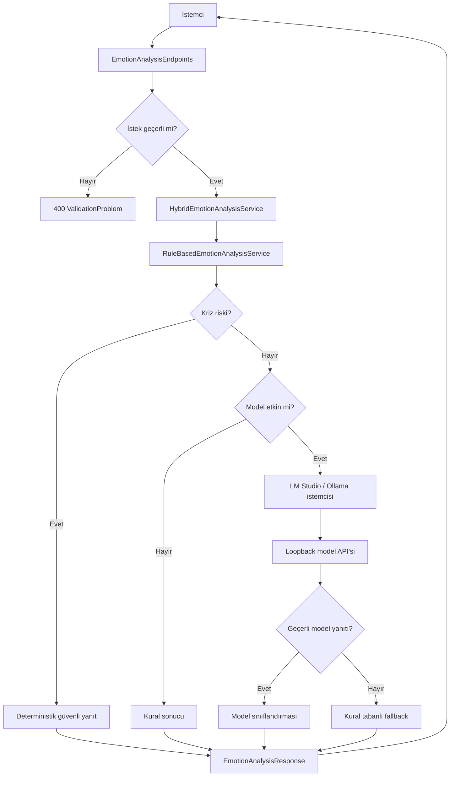

# Darklove Local AI Module Teknik Raporu

## 1. Belgenin Amacı

Bu belge, Darklove Local AI Module projesinin neden geliştirildiğini, mevcut
sürümde hangi kararların alındığını ve kodun nasıl çalıştığını ayrıntılı biçimde
açıklar. Belge; projeyi geliştiren kişinin kodu savunabilmesi, başka bir
geliştiricinin projeyi sürdürebilmesi ve Microsoft Yaz Okulu jürisinin teknik
yaklaşımı izleyebilmesi için hazırlanmıştır.

## 2. Projenin Problemi

Duygusal destek veya motivasyon uygulamaları, kullanıcıların hassas metinler
paylaşabildiği sistemlerdir. Bu metinlerin zorunlu olarak bulut tabanlı bir
yapay zekâ servisine gönderilmesi şu sorunları doğurabilir:

- Kullanıcı mahremiyeti konusunda endişe oluşabilir.
- İnternet bağlantısı olmadan sistem çalışmayabilir.
- Harici servis maliyeti veya kota sınırı oluşabilir.
- Sonucun neden üretildiğini açıklamak zorlaşabilir.
- Eğitim projesinde hata analizi dış servise bağımlı hale gelebilir.

Bu nedenle projenin uzun vadeli hedefi, duygu analizini ve destek mesajı
üretimini yerel cihazda gerçekleştirmektir.

## 3. Mevcut Sürümün Hedefi

Mevcut sürüm hibrit bir yerel AI uygulamasıdır. LM Studio veya Ollama üzerinde
çalışan açık bir dil modeli birincil duygu sınıflandırmasını yapar. Model kapalı,
eksik veya geçersiz yanıt verdiğinde açıklanabilir kural tabanlı servis
otomatik fallback sağlar.

Model entegrasyonunda şu sınırlar bilinçli olarak korunur:

- Kullanıcı metni yalnızca loopback üzerindeki yerel modele gönderilir.
- Model yalnızca yapılandırılmış duygu sınıflandırması üretir.
- Kriz tespiti modele bırakılmaz.
- Kullanıcıya verilen destek mesajları model tarafından yazılmaz.
- Hangi analiz yönteminin kullanıldığı API yanıtında açıkça belirtilir.

Başarı ölçütü yalnızca modelden yanıt almak değil; model bulunmadığında da
çalışan, güvenli ve test edilebilir bir sistem oluşturmaktır.

## 4. Kapsam ve Kapsam Dışı Konular

### Bu sürümde bulunanlar

- .NET 10 Web API
- Türkçe metin normalizasyonu
- Dört temel duygu kategorisi
- `neutral` ve `mixed` sonuçları
- Açıklanabilir skor ve eşleşen ifade listesi
- Kriz ifadesi kontrolü
- ProblemDetails doğrulaması
- Health check
- Aynı uygulama içinde sunulan Türkçe web demo ekranı
- OpenAPI ve Swagger UI
- Birim ve entegrasyon testleri
- GitHub Actions CI
- LM Studio ve Ollama yerel model entegrasyonu
- JSON Schema structured output
- Model durum endpointi
- Model kataloğu, aktif model seçimi ve model yükleme
- Web üzerinden model indirme ve ilerleme takibi
- Otomatik kural tabanlı fallback

### Bu sürümde bulunmayanlar

- Microsoft Foundry Local entegrasyonu
- Python deneyleri
- Veritabanı
- Kullanıcı hesabı ve kimlik doğrulama
- Kullanıcı metni geçmişi
- Ayrı dağıtılan veya ayrı derlenen frontend uygulaması
- Tıbbi tanı veya tedavi önerisi

Bu sınırlar projenin eksik olduğu anlamına gelmez. Sağlam MVP'nin hangi problemi
çözdüğünü ve sonraki fazın nerede başladığını açık hale getirir.

## 5. Teknoloji Seçimleri ve Nedenleri

### .NET 10

.NET 10 güncel uzun destekli .NET sürümüdür. Güçlü tip sistemi, yerleşik
dependency injection, health check, ProblemDetails ve OpenAPI desteği bu proje
için gereken altyapıyı az ek bağımlılıkla sağlar.

### ASP.NET Core Minimal API

Projede küçük ve odaklı bir HTTP yüzeyi vardır. Bu nedenle controller tabanlı daha ağır bir
yapı yerine Minimal API kullanılmıştır. Minimal API seçimi iş mantığının
`Program.cs` içine yazılması anlamına gelmez. Endpoint yalnızca HTTP
sorumluluklarını taşır, analiz ayrı servistedir.

### Dependency Injection

`IEmotionAnalysisService`, endpoint ile hibrit analiz uygulaması arasındaki
sözleşmedir. `HybridEmotionAnalysisService`, güvenlik kuralları, yerel model istemcisi
ve fallback akışını koordine eder.

`IOpenSourceModelClient`, belirli model çalışma zamanını soyutlar.
`LmStudioOpenSourceModelClient` geliştirme ortamındaki birincil uygulamadır;
`OllamaOpenSourceModelClient` alternatif sağlayıcı olarak korunur. Gelecekte
Foundry Local için aynı arayüzü uygulayan yeni bir adaptör eklenebilir.

### LM Studio, Ollama ve Structured Output

LM Studio, model kataloğu, model yükleme, model indirme ve OpenAI uyumlu chat
endpointleri sağlar. Proje `/api/v1/models`, `/api/v1/models/load`,
`/api/v1/models/download` ve `/v1/chat/completions` endpointlerini kullanır.
Ollama sağlayıcısı `/api/tags`, `/api/pull` ve `/api/chat` endpointlerini
kullanır. Her iki sağlayıcıda sıcaklık `0` ve JSON şeması kullanılarak sonucun
daha deterministik olması hedeflenir.

Modelin JSON üretmesi tek başına yeterli kabul edilmez. Uygulama ayrıca:

- Duygu adının izin verilen listede olduğunu,
- Confidence değerinin 0-1 arasında olduğunu,
- Beş model skorunun eksiksiz olduğunu,
- Her skorun 0-1 arasında olduğunu

kontrol eder.

### OpenAPI ve Swagger UI

OpenAPI, API'nin makine tarafından okunabilir sözleşmesini üretir. Swagger UI
ise jüri demosunda ve geliştirme sırasında endpointlerin tarayıcıdan
çalıştırılmasını sağlar. Bilgi ifşasını azaltmak için Swagger UI yalnızca
Development ortamında etkinleştirilmiştir.

### Yerleşik Web Demo

`wwwroot` altındaki HTML, CSS ve JavaScript dosyaları ASP.NET Core tarafından
aynı uygulama üzerinden sunulur. Bu yaklaşım jüri demosu için ayrı bir Node.js
projesi, paket yöneticisi veya ikinci sunucu gerektirmez. Tarayıcı doğrudan
`/api/model/status`, `/api/models/` ve `/api/emotion/analyze` endpointlerini çağırır.

Arayüz erişilebilir form etiketleri, klavye ile kullanılabilen hazır örnekler,
mobil uyumlu yerleşim ve hareket azaltma tercihi içerir. Sonuç ekranda
`analysisMethod` ve `fallbackReason` alanları da gösterildiği için model ile
kural tabanlı geri dönüş birbirinden gizlenmez.

Model yöneticisi yalnızca çalışabilir LLM kayıtlarını gösterir. Embedding
modelleri ve görsel `mmproj` yardımcı dosyaları ayrı dil modeli gibi sunulmaz.
İndirme girdi doğrulaması katalog kimliklerine ve doğrudan `huggingface.co`
bağlantılarına izin verir. Böylece web endpointinin genel amaçlı uzak URL
indiricisine dönüşmesi engellenir.

### xUnit ve WebApplicationFactory

xUnit saf iş mantığını test eder. `WebApplicationFactory<Program>` uygulamayı
gerçek Kestrel portu açmadan test sunucusunda çalıştırarak route, JSON,
dependency injection, doğrulama ve middleware davranışını birlikte doğrular.

## 6. Proje Mimarisi



Temel tasarım ilkesi sorumluluk ayrımıdır:

- `wwwroot` yalnızca sunum ve kullanıcı etkileşimini yönetir.
- `Program.cs` uygulamayı kurar.
- Endpoint HTTP isteğini yönetir.
- Hibrit servis model ve fallback kararını üretir.
- Sağlayıcı istemcileri yerel model iletişimini yönetir.
- Model yöneticisi katalog, seçim, yükleme ve indirme akışını yönetir.
- DTO'lar dış API sözleşmesini tanımlar.
- Testler davranışı korur.

## 7. Klasör ve Dosyaların Görevleri

### `Darklove.LocalAI.slnx`

API ve test projelerini tek çözüm altında toplar. `dotnet build` ve `dotnet test`
komutlarının tüm projelerde birlikte çalışmasını sağlar.

### `darklove.cmd`

Windows kullanıcısının PowerShell yürütme ayrıntılarını bilmeden terminal
istemcisini açmasını sağlayan en küçük giriş dosyasıdır. Çalışma klasörünü
deponun köküne taşır, UTF-8 kod sayfasını etkinleştirir ve aldığı seçenekleri
`scripts/darklove-cli.ps1` dosyasına aktarır.

### `scripts/darklove-cli.ps1`

CMD deneyiminin asıl mantığını içerir. API zaten açıksa doğrudan onu kullanır.
API kapalıysa mevcut Release çıktısını açar; henüz çıktı yoksa yalnızca API
projesini derler. Uygulamayı gizli bir alt süreç olarak `http://localhost:5019`
adresinde başlatır ve health endpointi hazır olana kadar bekler.

Varsayılan terminal davranışı sohbet modudur. Kullanıcı mesajı `/api/chat`
endpointine gönderilir ve model adı, analiz yöntemi veya güven yüzdesi gibi
teknik alanlar terminalde gösterilmez. Duygu analizi istenirse kullanıcı
`analiz` komutunu açıkça yazar; bu durumda o ana kadarki sohbet geçmişi
transcript haline getirilir ve mevcut `/api/emotion/analyze` endpointi
kullanılır. `analiz <metin>` komutu ise sohbet geçmişine ek olarak verilen
metni de analize dahil eder.

İstemci `analiz`, `modeller`, `durum`, `şartlar`, `yardım` ve `çıkış`
komutlarını destekler. `şartlar`, tıbbi teşhis olmadığı ve model güven
değerlerinin klinik olasılık olmadığı uyarılarını gösterir. `-Once` seçeneği
tek bir sohbet mesajı gönderip kapanan sunum/otomasyon kullanımını, `-NoStart`
seçeneği ise yalnızca önceden çalışan API'ye bağlanmayı sağlar. İstemci API'yi
kendisi başlattıysa çıkışta yalnızca o süreci kapatır.

### `backend/Darklove.LocalAI.Api/Program.cs`

Uygulamanın başlangıç noktasıdır:

1. OpenAPI servisini ekler.
2. Exception handler ve ProblemDetails yapılandırmasını ekler.
3. Health check altyapısını kaydeder.
4. Kural servisini singleton, hibrit analiz servisini request scope içinde kaydeder.
5. Development ortamında OpenAPI ve Swagger UI'ı açar.
6. Ortama göre HSTS ve HTTPS yönlendirmesini ayarlar.
7. Varsayılan belge ve statik dosya middleware'ini etkinleştirir.
8. Health, model yönetimi ve emotion endpointlerini eşler.

Dosyanın sonunda bulunan `public partial class Program`, entegrasyon testlerinin
uygulama giriş noktasını bulabilmesi için gereklidir.

### `backend/Darklove.LocalAI.Api/wwwroot`

API ile birlikte sunulan yerel demo ekranını içerir:

- `index.html`: Analiz formunu, model yöneticisini, örnek metinleri ve sonuç bölgelerini tanımlar.
- `styles.css`: Mobil uyumlu görünümü, model kartlarını, odak stillerini ve kriz vurgusunu sağlar.
- `app.js`: Analiz ve model yönetimi API isteklerini gönderir, indirme ilerlemesini
  izler ve sonuçları güvenli biçimde DOM üzerinde gösterir.

JavaScript kullanıcı veya model metnini HTML olarak eklemez; `textContent`
kullanır. Böylece yanıt içeriğinin çalıştırılabilir işaretlemeye dönüşmesi önlenir.

### `Features/EmotionAnalysis/Contracts/EmotionAnalysisRequest.cs`

İstemciden alınan JSON gövdesini temsil eder. `UserText` nullable tanımlanmıştır;
çünkü eksik veya `null` gelen değer endpoint doğrulaması tarafından anlamlı bir
400 yanıtına dönüştürülmelidir.

### `Features/EmotionAnalysis/Contracts/EmotionAnalysisResponse.cs`

Analizin dışarıya açık sonucudur:

- `DetectedEmotion`: Seçilen duygu kodu
- `Confidence`: Sezgisel güven değeri
- `Scores`: Her duygu için eşleşme sayısı
- `MatchedKeywords`: Eşleşen kurallar
- `RiskLevel`: `none` veya `high`
- `NeedsSupportWarning`: Eski istemciler için boolean uyarı
- `MotivationMessage`: Türkçe kullanıcı mesajı
- `AnalysisMethod`: Açık model, kural, fallback veya kriz güvenlik yöntemini belirtir
- `Model`: Kullanılan ya da denenmiş yerel modelin adı
- `ModelScores`: Model kullanıldıysa 0-1 aralığındaki duygu skorları
- `FallbackReason`: Model yerine kurallara dönülme nedenini sabit bir kodla açıklar

### `Features/EmotionAnalysis/Services/IEmotionAnalysisService.cs`

Analiz yeteneğinin soyut sözleşmesidir. Endpoint somut sınıfa değil bu arayüze
bağımlıdır. Bu, test edilebilirliği ve gelecekte model değiştirmeyi kolaylaştırır.

### `Features/EmotionAnalysis/Services/RuleBasedEmotionAnalysisService.cs`

Projenin ana iş mantığıdır. Şunları gerçekleştirir:

- Türkçe ve Unicode normalizasyonu
- Duygu kurallarının değerlendirilmesi
- Kriz ifadelerinin bağımsız kontrolü
- Skorların hazırlanması
- `neutral`, `mixed` veya tek duygu seçimi
- Güven değerinin hesaplanması
- Uygun kullanıcı mesajının seçilmesi

Servis herhangi bir değişken kullanıcı durumu saklamadığı için singleton olarak
güvenle kullanılabilir. Statik kurallar yalnızca okunur.

### `Features/EmotionAnalysis/Services/HybridEmotionAnalysisService.cs`

Analiz akışının koordinatörüdür:

1. Kural tabanlı güvenlik ve açıklanabilirlik sonucunu üretir.
2. Kriz riski varsa modeli çağırmadan bu sonucu döndürür.
3. Model kapalıysa kural sonucunu döndürür.
4. Model açıksa structured classification ister.
5. Başarılı model sonucunu güvenli mesaj politikasıyla birleştirir.
6. Model hatasında `rule-based-fallback` sonucunu döndürür.

Fallback nedeni kullanıcı metnini içermeyen sabit kodlarla açıklanır:
`model-unavailable`, `model-not-found`, `model-timeout`,
`invalid-model-response` veya `model-error`.

### `Features/EmotionAnalysis/Services/OllamaOpenSourceModelClient.cs`

Ollama `/api/chat` ve `/api/tags` endpointlerini kullanır. Duygu
sınıflandırması için JSON şeması gönderir, model yanıtını ayrıştırır ve
doğrular. `/api/tags`, seçilen modelin indirilmiş olup olmadığını anlamak için
kullanılır.

### `Features/EmotionAnalysis/Services/LmStudioOpenSourceModelClient.cs`

LM Studio REST API üzerinden LLM kataloğunu okur, seçilen modeli belleğe yükler,
indirme işi başlatır ve iş ilerlemesini sorgular. Duygu sınıflandırması için
OpenAI uyumlu `/v1/chat/completions` endpointine JSON Schema gönderir.

### `Features/EmotionAnalysis/Services/LocalModelSelection.cs`

Aktif model adını thread-safe biçimde uygulama belleğinde tutar. Web ekranında
seçilen model, sonraki analiz isteğinde `HybridEmotionAnalysisService` tarafından
okunur. Kullanıcı metni veya analiz geçmişi bu serviste saklanmaz.

### `Features/EmotionAnalysis/Services/LmStudioRuntimeLauncher.cs`

LM Studio kuruluysa beraberinde gelen `lms` komutunu bulur, arka plan daemon'unu
ve yalnızca `127.0.0.1` adresine bağlanan API sunucusunu başlatır. Bu özellik
geliştirme ayarındaki `AutoStartRuntime` anahtarıyla kapatılabilir.

### `Features/EmotionAnalysis/Models/LocalModelOptions.cs`

Model kullanımının açık olup olmadığını, sağlayıcıyı, endpointi, model adını,
zaman aşımını ve runtime otomatik başlatma seçeneğini tanımlar. Endpoint
doğrulaması yalnızca loopback adreslerine izin
verir. Bu kontrol hassas metnin yanlışlıkla uzaktaki bir sunucuya gönderilmesini
önler.

### `Features/EmotionAnalysis/Endpoints/OpenSourceModelEndpoints.cs`

Model yönetim API'sini tanımlar:

- `GET /api/model/status`: Seçili modelin özet durumunu döndürür.
- `GET /api/models/`: Bilgisayardaki çalışabilir LLM'leri listeler.
- `PUT /api/models/selected`: Modeli belleğe yükler ve aktif hale getirir.
- `POST /api/models/downloads`: Model indirme işi başlatır.
- `GET /api/models/downloads/{jobId}`: İndirme ilerlemesini döndürür.

### `Features/EmotionAnalysis/Endpoints/EmotionAnalysisEndpoints.cs`

`POST /api/emotion/analyze` endpointini tanımlar. En fazla 2.000 karakter
kuralını uygular, boş metni reddeder ve hataları `ValidationProblem` olarak
döndürür. Analizi kendisi yapmaz; servise iletir.

Endpoint metadata'sı Swagger'da özet, açıklama, kabul edilen gövde ve olası HTTP
yanıtlarını gösterir.

### `Infrastructure/Health/HealthEndpointExtensions.cs`

`GET /api/health` endpointini tanımlar. Yerleşik `HealthCheckService` üzerinden
kontrolleri çalıştırır ve servisin durumunu JSON olarak döndürür. Gelecekte bir
model servisi veya veritabanı eklenirse aynı health altyapısına yeni kontroller
eklenebilir.

### `appsettings.json`

Genel log seviyelerini, host politikasını ve varsayılan HTTPS yönlendirme
ayarını taşır. Kullanıcı metni için özel bir loglama yapılmaz.

### `appsettings.Development.json`

Yerel HTTP geliştirme profilinde HTTPS portu bulunamadı uyarısı oluşmaması için
HTTPS yönlendirmesini varsayılan olarak kapatır. Ayrıca LM Studio sağlayıcısını,
`localhost:1234` endpointini ve otomatik runtime başlatmayı etkinleştirir.

### `Properties/launchSettings.json`

İki geliştirme profili sağlar:

- `http`: `http://localhost:5019`
- `https`: `https://localhost:7239`

Her iki profil kök adresteki web demo ekranını açar. HTTPS profili yönlendirmeyi ortam
değişkeniyle tekrar etkinleştirir.

### `Darklove.LocalAI.Api.http`

IDE içinden health, normal analiz, mixed sonuç, kriz yanıtı ve doğrulama hatası
isteklerini çalıştırmak için hazır örnekler içerir.

### `tests/Darklove.LocalAI.Api.Tests`

Saf servis testlerini ve HTTP entegrasyon testlerini içerir. Test projesi üretim
projesine `ProjectReference` ile bağlıdır.

### `.github/workflows/ci.yml`

Main branch pushlarında ve pull requestlerde şu sırayı otomatik çalıştırır:

1. Depoyu indirir.
2. .NET 10 SDK kurar.
3. NuGet paketlerini restore eder.
4. Release build alır.
5. Tüm testleri çalıştırır.

## 8. Metin Analizi Algoritması

### 8.1 Normalizasyon

Kullanıcı metni doğrudan karşılaştırılmaz. Önce:

1. Unicode `FormC` biçimine dönüştürülür.
2. `tr-TR` kültürüyle küçük harfe çevrilir.
3. Birden fazla boşluk tek boşluğa indirilir.
4. Baş ve sondaki boşluklar temizlenir.

Türkçe kültürü özellikle `I`, `İ`, `ı` ve `i` dönüşümleri için önemlidir.
Standart kültürden bağımsız dönüşüm Türkçe metinlerde yanlış eşleşmeye yol
açabilir.

### 8.2 Tam Kelime ve İfade Eşleşmesi

Her anahtar ifade Unicode harf ve sayı sınırlarını kontrol eden bir düzenli
ifadeye dönüştürülür:

```text
(?<![harf veya sayı])ANAHTAR_IFADE(?![harf veya sayı])
```

Bu yaklaşım sayesinde `sinir` kelimesini arayıp `sinir sistemi` ifadesini öfke
olarak işaretlemek yerine yalnızca `sinirliyim` gibi açık kurallar kullanılır.

### 8.3 Kural Listeleri

Dört duygu kategorisi vardır:

- `sadness`: üzgünlük, yalnızlık, yorgunluk ve mutsuzluk ifadeleri
- `anxiety`: kaygı, stres, panik, korku ve gerginlik ifadeleri
- `hope`: umut, iyi hissetme, başarma ve toparlanma ifadeleri
- `anger`: sinirlilik, öfke, bıkma ve kızgınlık ifadeleri

Bağlamı zayıf olan tek başına `iyi` veya `sinir` gibi kurallar kullanılmaz.

### 8.4 Tekrarların Puanlanması

Bir kural metinde kaç kez tekrarlanırsa tekrarlansın yalnızca bir puan verir.

Örnek:

```text
Yorgunum, gerçekten yorgunum ve yine yorgunum.
```

`yorgunum` kuralının sadness skoruna katkısı `1` olur. Böylece kullanıcının aynı
kelimeyi tekrarlaması güven değerini yapay biçimde yükseltmez.

### 8.5 Duygu Seçimi

```text
topScore = en yüksek duygu skoru

eğer topScore == 0:
    detectedEmotion = neutral
aksi halde en yüksek skora sahip birden fazla duygu varsa:
    detectedEmotion = mixed
aksi halde:
    detectedEmotion = en yüksek skorlu duygu
```

Eşitlikte ilk dictionary elemanını seçmek yerine `mixed` dönülmesi sonucu daha
dürüst ve açıklanabilir yapar.

## 9. Güven Değeri

`confidence` değeri kullanılan analiz yöntemine bağlıdır.

- `analysisMethod=open-source-model` ise doğrulanmış model confidence değeridir.
- Kural veya fallback kullanıldıysa aşağıdaki sezgisel formülle hesaplanır.

Bu değer klinik güven, tanı olasılığı veya istatistiksel olarak kalibre edilmiş
bir risk skoru değildir.

### Neutral

```text
confidence = 0.0
```

Eşleşme olmadığı için güven sıfırdır.

### Mixed

```text
confidence = min(0.70, 0.40 + topScore × 0.10)
```

Birden fazla duygu eşit olduğundan değer `0.70` ile sınırlandırılır.

### Tek Duygu

```text
scoreMargin = topScore - secondScore
confidence = min(
    0.95,
    0.50 + topScore × 0.10 + scoreMargin × 0.10
)
```

En yüksek skor arttıkça ve ikinci duyguya fark açıldıkça güven yükselir.

Örnek:

```text
sadness = 2
ikinci skor = 0
scoreMargin = 2
confidence = 0.50 + 0.20 + 0.20 = 0.90
```

Sonuç iki ondalık basamağa yuvarlanır.

## 10. Kriz Güvenliği

Kriz ifadeleri duygu skorundan bağımsız değerlendirilir. Bunun nedeni,
`yaşamak istemiyorum` gibi bir metnin ana duygu kurallarından hiçbiriyle
eşleşmemesi durumunda bile güvenlik açısından önemli olmasıdır.

Risk eşleşirse:

- `riskLevel` değeri `high` olur.
- `needsSupportWarning` değeri `true` olur.
- Normal motivasyon mesajı kullanılmaz.
- Kullanıcıya yalnız kalmaması ve güvendiği bir kişiye ulaşması söylenir.
- Profesyonel destek istemesi önerilir.
- Hayati tehlikede Türkiye'de 112'yi araması belirtilir.

Bu mekanizma bir risk değerlendirme veya teşhis sistemi değildir. Yalnızca
sınırlı ve açık ifadeler için koruyucu yönlendirme sağlar.

## 11. İstek Doğrulama ve Hata Yönetimi

### Boş metin

`null`, boş veya yalnızca boşluk içeren metin `400 Bad Request` döndürür.

### Uzun metin

2.000 karakter üzerindeki metin `400 Bad Request` döndürür. Bu sınır, MVP'nin
kısa kullanıcı mesajı amacına uygundur ve gereksiz kaynak tüketimini sınırlar.

### Bozuk JSON

JSON ayrıştırma hataları `BadHttpRequestException` olarak yakalanır ve genel
500 hatasına dönüşmeden `400 ProblemDetails` olarak döndürülür.

### ProblemDetails

Hata yanıtları ortak bir yapı kullanır:

```json
{
  "title": "İstek doğrulanamadı.",
  "status": 400,
  "detail": "Lütfen kullanıcı metnini kontrol edip tekrar deneyin.",
  "errors": {
    "userText": [
      "Kullanıcı metni boş bırakılamaz."
    ]
  },
  "traceId": "..."
}
```

`traceId`, kullanıcı metnini göstermeden teknik hata takibini kolaylaştırır.

## 12. API Sözleşmesi

### Health

```http
GET /api/health
```

```json
{
  "status": "running",
  "project": "Darklove Local AI Module",
  "version": "1.0.0",
  "module": "backend-api"
}
```

### Local Model Status

```http
GET /api/model/status
```

```json
{
  "provider": "ollama",
  "model": "qwen3:4b",
  "runtimeAvailable": true,
  "modelAvailable": true,
  "status": "ready"
}
```

### Emotion Analyze

```http
POST /api/emotion/analyze
Content-Type: application/json
```

```json
{
  "userText": "Bugün kendimi yalnız ve yorgun hissediyorum."
}
```

Başarılı yanıt:

```json
{
  "detectedEmotion": "sadness",
  "confidence": 0.9,
  "scores": {
    "sadness": 2,
    "anxiety": 0,
    "hope": 0,
    "anger": 0
  },
  "matchedKeywords": {
    "sadness": [
      "yalnız",
      "yorgun"
    ]
  },
  "riskLevel": "none",
  "needsSupportWarning": false,
  "motivationMessage": "Bugün zor geçiyor olabilir...",
  "analysisMethod": "open-source-model",
  "model": "qwen3:4b",
  "modelScores": {
    "sadness": 0.86,
    "anxiety": 0.08,
    "hope": 0.02,
    "anger": 0.01,
    "neutral": 0.03
  }
}
```

`scores`, kural tabanlı eşleşme sayılarını korur. `modelScores`, model
sınıflandırmasının 0-1 aralığındaki ayrı skorlarını gösterir. Model kullanılamaz
ve fallback çalışırsa `fallbackReason` alanı eklenir.

## 13. Gizlilik ve Etik Kararlar

- Kullanıcı metni veritabanına yazılmaz.
- Kullanıcı metni loglanmaz.
- Harici bulut AI servisine istek gönderilmez.
- Model endpointi yalnızca loopback olabilir.
- Modelden destek mesajı veya kriz tavsiyesi alınmaz.
- API sonucu tıbbi teşhis olarak sunulmaz.
- Confidence değeri klinik olasılık gibi tanıtılmaz.
- Kriz mesajı, kullanıcıyı uygulamaya bağımlı kılmak yerine gerçek insan ve acil
  yardım kaynaklarına yönlendirir.
- Swagger UI üretim ortamında kapalıdır.
- Projede secret veya API anahtarı bulunmaz.

## 14. Test Stratejisi

### Birim testleri neden var?

Analiz servisi HTTP'den bağımsızdır. Birim testleri kuralları hızlı ve
deterministik biçimde doğrular:

- Dört duygu kategorisinin algılanması
- Eşleşme olmadığında neutral sonucu
- Eşit skorda mixed sonucu
- Türkçe büyük harf dönüşümü
- Tekrarlanan kuralın bir kez sayılması
- Tam kelime eşleşmesi
- Güven formülü
- Kriz mesajı ve 112 yönlendirmesi
- Model başarılı olduğunda hibrit sonucun kullanılması
- Model hatasında fallback
- Kriz metninde model istemcisinin çağrılmaması
- Model kapalıyken yalnızca kuralların kullanılması
- Ollama JSON sözleşmesinin ayrıştırılması
- LM Studio structured output sözleşmesinin ayrıştırılması
- LM Studio kataloğunda embedding modellerinin filtrelenmesi
- Aktif model seçiminin model yükleme endpointine gitmesi
- İndirme işi ve byte alanlarının ayrıştırılması
- Güvenilmeyen model indirme URL'lerinin reddedilmesi
- Geçersiz model yanıtının reddedilmesi
- Model status sonucunun doğrulanması

### Entegrasyon testleri neden var?

Servisin tek başına doğru olması API'nin doğru olduğu anlamına gelmez.
Entegrasyon testleri şunları doğrular:

- Health endpointinin gerçek JSON cevabı
- Dependency injection ile analiz servisinin çağrılması
- JSON serileştirme
- Boş ve uzun metin için ProblemDetails
- Bozuk JSON için 400 yanıtı
- OpenAPI belgesinin erişilebilirliği
- Swagger UI'ın Development ortamında erişilebilirliği
- Model status endpointinin erişilebilirliği
- Model kapalıyken katalog endpointinin güvenli boş yanıtı
- Model kapalıyken seçim endpointinin ProblemDetails yanıtı
- Kök adresteki demo sayfasının erişilebilirliği
- CSS ve JavaScript dosyalarının doğru içerik türü ve `nosniff` başlığıyla sunulması

Toplam 38 test bulunmaktadır.

## 15. Kurulum ve Çalıştırma

### Gereksinimler

- .NET 10 SDK
- LM Studio veya Ollama

Bu geliştirme ortamında LM Studio zaten kurulu olduğu için ek kurulum gerekmez.
Uygulama `lms daemon up` ve `lms server start` işlemlerini gerektiğinde otomatik
çalıştırır. Yeni modeller web ekranındaki model yöneticisinden indirilebilir.
Başka bir bilgisayarda model dosyasını çalıştırmak için desteklenen yerel
runtime'lardan en az biri önceden kurulu olmalıdır.

### Restore

```powershell
dotnet restore Darklove.LocalAI.slnx
```

### Derleme

```powershell
dotnet build Darklove.LocalAI.slnx
```

### HTTP profili

```powershell
dotnet run --project backend/Darklove.LocalAI.Api --launch-profile http
```

Web demo:

```text
http://localhost:5019
```

Swagger:

```text
http://localhost:5019/swagger
```

### HTTPS profili

```powershell
dotnet run --project backend/Darklove.LocalAI.Api --launch-profile https
```

Web demo:

```text
https://localhost:7239
```

Swagger:

```text
https://localhost:7239/swagger
```

### Test

```powershell
dotnet test Darklove.LocalAI.slnx
```

### Windows CMD istemcisi

Proje klasöründe `darklove.cmd` dosyasına çift tıklanabilir veya CMD içinde şu
komut çalıştırılabilir:

```cmd
darklove.cmd
```

API'nin ayrıca başlatılması gerekmez. Derlenmiş çıktı yoksa ilk çalıştırmada API
projesi otomatik derlenir. Terminal açıldıktan sonra doğrudan mesaj yazılır.
Yardımcı komutlar:

```text
analiz          O ana kadarki sohbeti duygu açısından analiz eder.
analiz <metin>  Sohbet geçmişiyle birlikte ek metni analiz eder.
modeller  Bilgisayardaki yerel modelleri listeler.
durum     Yerel model sağlayıcısının durumunu gösterir.
şartlar   Kullanım şartlarını ve güvenlik notlarını gösterir.
yardım    Komut listesini gösterir.
çıkış     İstemciyi ve istemcinin başlattığı API'yi kapatır.
```

Tek seferlik sohbet örneği:

```cmd
darklove.cmd -Once "Naber, nasıl gidiyor?"
```

## 16. Jüri Demo Akışı

1. CMD içinde `darklove.cmd` çalıştırıp sade sohbet akışını göster.
2. `modeller` komutuyla bilgisayardaki yerel LLM'leri göster.
3. Kök adresteki Türkçe web demo ekranını aç.
4. Model yöneticisinde model boyutunu ve quantization bilgisini göster.
5. **Yükle ve kullan** ile modeli aktif hale getir.
6. Hazır örneklerden normal bir metni analiz et.
7. `analysisMethod`, `modelScores` ve model adını açıkla.
8. Kriz örneğinde modele gidilmeden güvenli mesaj üretildiğini göster.
9. Swagger UI'da `GET /api/health` ve model yönetim sözleşmesini göster.
10. Terminalde `dotnet test Darklove.LocalAI.slnx` çalıştır ve testleri göster.
11. Foundry Local için aynı istemci arayüzüne yeni adaptör eklenebileceğini
    anlat.

## 17. Bilinen Sınırlamalar

- Sonuç kalitesi seçilen modelin kapasitesine ve donanıma bağlıdır.
- Küçük modeller ironi, mecaz ve olumsuzlukta hata yapabilir.
- Model skorları istatistiksel veya klinik olarak kalibre edilmemiştir.
- İlk model yüklemesi ve düşük donanımda çıkarım yavaş olabilir.
- Fallback yalnızca tanımlı Türkçe ifadeleri tanır.
- Kriz kontrolü tüm olası risk ifadelerini kapsamaz.
- Üretim kullanımı için uzman değerlendirmesi ve daha kapsamlı güvenlik
  politikaları gerekir.

Bu sınırlamalar sunumda açıkça belirtilmelidir.

## 18. Gelecek Geliştirme Tasarımı

Foundry Local entegrasyonu geldiğinde önerilen yaklaşım:

1. `FoundryLocalOpenSourceModelClient` sınıfını oluştur.
2. `IOpenSourceModelClient` arayüzünü uygula.
3. Native chat completion sonucunu `OpenSourceModelClassification` biçimine
   dönüştür.
4. `LocalModel:Provider` değerine göre Ollama veya Foundry Local istemcisini
   kaydet.
5. Kriz kontrolünü ve fallback servisini değiştirmeden koru.
6. Aynı test veri kümesinde iki çalışma zamanını karşılaştır.

Bu mimari sayesinde mevcut endpoint ve istemci sözleşmesi korunabilir.

## 19. Sonuç

Proje ilk prototipten, açık ağırlıklı yerel model çalıştırabilen ve model
hatalarında güvenli biçimde çalışmaya devam eden hibrit bir uygulamaya
dönüştürülmüştür.

LM Studio ve Ollama entegrasyonları gerçek model sınıflandırması sağlar. Kural tabanlı servis
ise açıklanabilirlik, kriz güvenliği ve çalışma sürekliliği görevlerini korur.
Bu ayrım, Microsoft Foundry Local gibi başka çalışma zamanlarının kontrollü
biçimde eklenmesini kolaylaştırır.

## 20. Kaynaklar

- [ASP.NET Core 10 OpenAPI](https://learn.microsoft.com/aspnet/core/fundamentals/openapi/overview?view=aspnetcore-10.0)
- [OpenAPI belgesini Swagger UI ile kullanma](https://learn.microsoft.com/aspnet/core/fundamentals/openapi/using-openapi-documents?view=aspnetcore-10.0)
- [ASP.NET Core Minimal APIs](https://learn.microsoft.com/aspnet/core/fundamentals/minimal-apis?view=aspnetcore-10.0)
- [ASP.NET Core Integration Tests](https://learn.microsoft.com/aspnet/core/test/integration-tests?view=aspnetcore-10.0)
- [Ollama Chat API](https://docs.ollama.com/api/chat)
- [Ollama Structured Outputs](https://docs.ollama.com/capabilities/structured-outputs)
- [LM Studio yerel API sunucusu](https://lmstudio.ai/docs/developer/core/server)
- [LM Studio model listesi](https://lmstudio.ai/docs/developer/rest/list)
- [LM Studio model indirme](https://lmstudio.ai/docs/developer/rest/download)
- [LM Studio structured output](https://lmstudio.ai/docs/developer/openai-compat/structured-output)
- [Microsoft Foundry Local başlangıç](https://learn.microsoft.com/azure/foundry-local/get-started)
- [T.C. 112 Acil Çağrı Merkezi](https://www.112.gov.tr/112-acm-projesi)
